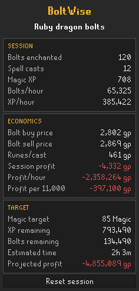

# Bolt Enchant Tracker (BoltWise)

Current version: **v1.1.1**

BoltWise automatically detects bolt enchanting and shows live session speed, Magic XP, supplies, costs, estimated profit, and progress toward a target Magic level.

The plugin is observational only. It never clicks, casts, types, withdraws, equips, or otherwise performs game actions.

## Features

- Detects all ten gem bolt types in both standard and dragon-bolt variants
- Tracks bolts enchanted, spell casts, Magic XP, bolts/hour, and XP/hour
- Uses RuneLite guide prices for unfinished bolts, enchanted bolts, and required runes
- Supports actual buy and expected sell price overrides
- Includes optional Grand Exchange tax
- Accounts for free air, water, earth, or fire runes supplied by equipment
- Calculates session profit, profit/hour, and profit per 11,000 bolts
- Projects XP, bolts, time, and profit remaining to a selected Magic level
- Includes a statistics-only session reset in the sidebar
- Preserves the active session safely across world hops
- Auto-pauses hourly rates after five seconds without an enchantment
- Shows live bolt and required-rune supplies using real item sprites
- Includes runes stored in the Rune Pouch and compatible combination runes
- Calculates casts remaining and identifies the limiting supply
- Adds an optional movable in-game overlay for supplies and live rates

## Using BoltWise

1. Enable **Bolt Enchant Tracker** in RuneLite's Plugin Hub.
2. Open the BoltWise sidebar using the gold bolt icon.
3. Choose your target Magic level and configure any price or free-rune settings.
4. Start enchanting bolts. BoltWise begins tracking automatically.

Enable **Show in-game overlay** to display supplies, casts left, and live rates over the game. Enable **Auto-pause** to prevent idle time from reducing your hourly rates when you stop enchanting.

## Important pricing note

Guide prices are estimates and may differ from actual Grand Exchange fills. Enter your actual buy price and intended sell price in the RuneLite plugin configuration for a more realistic projection. Reset the session when changing bolt types if price overrides are enabled.

If using a Tome of Fire or an appropriate elemental staff, enable the matching **Free runes** setting so those elemental runes are not counted as a cost.

## License

BSD 2-Clause License. See `LICENSE`.
